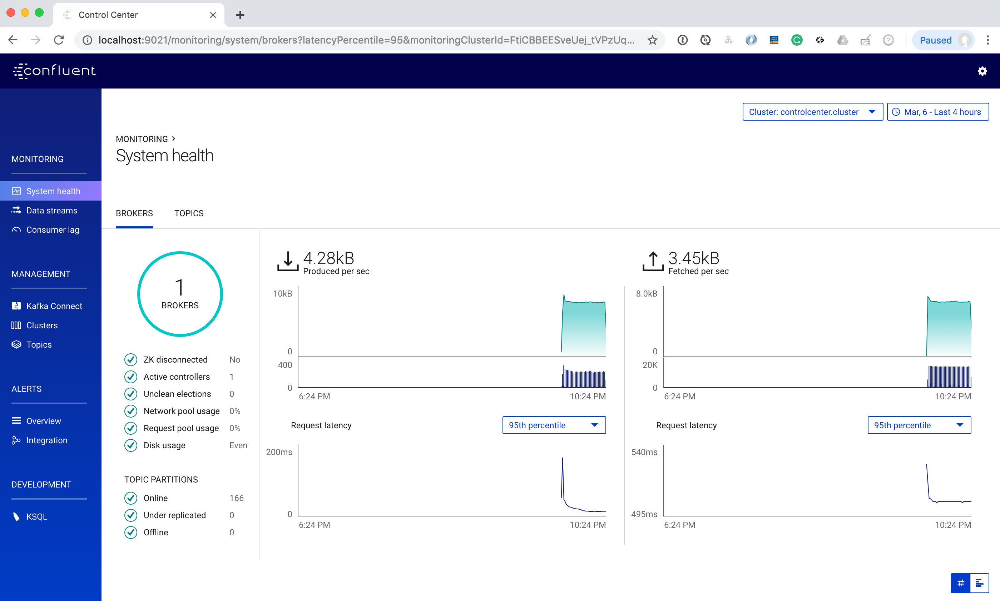
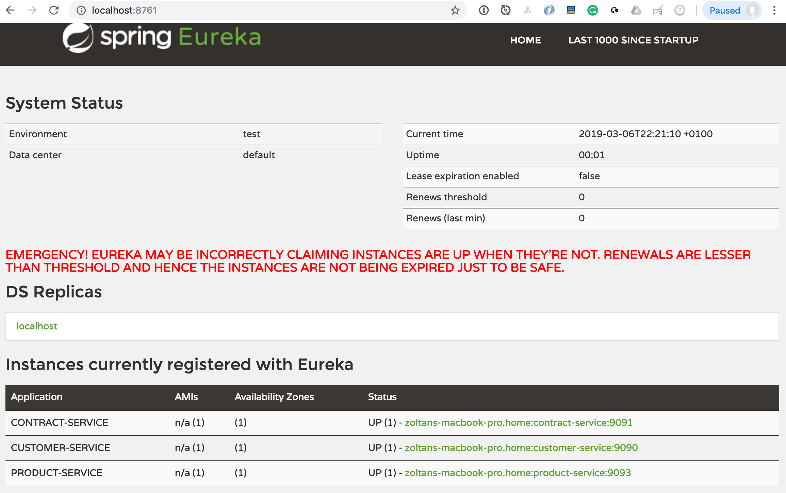
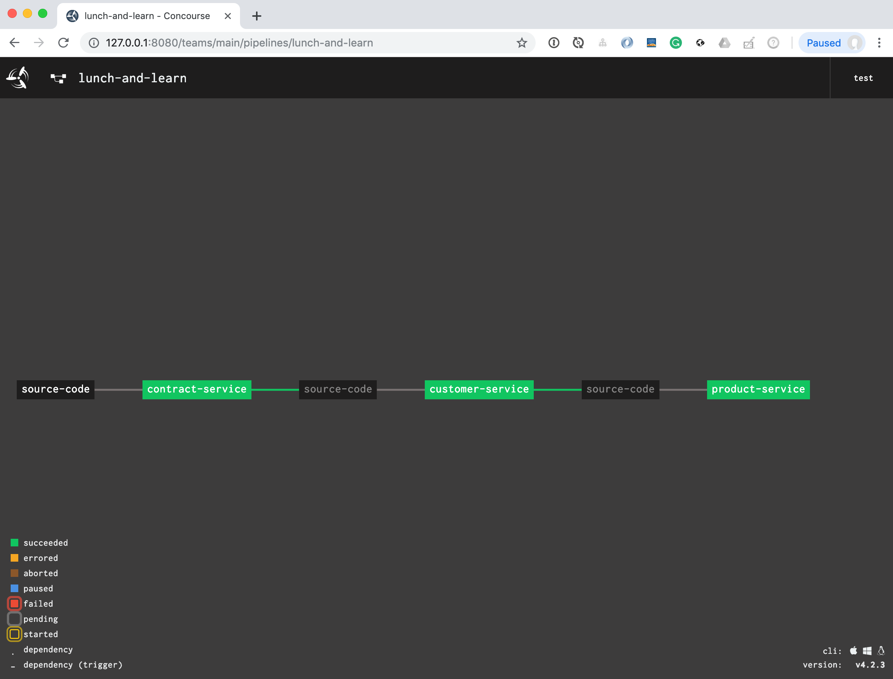

## Setup up locally

1. Clone and build the project:

```bash
$ git clone https://github.com/altfatterz/2019-03-08-mimacom-lunch-and-learn
$ cd 2019-03-08-mimacom-lunch-and-learn
$ mvn clean install
```

2. Start Eureka. With [Spring CLI](https://docs.spring.io/spring-boot/docs/current/reference/html/getting-started-installing-spring-boot.html) (and [Spring Cloud plugin](https://cloud.spring.io/spring-cloud-cli/)) is very easy. Note, with the latest version I had problems, I am using here earlier versions.

```bash
$ spring --version
Spring CLI v2.0.8.RELEASE
$ spring cloud --version
Spring Cloud CLI v2.0.0.RELEASE
$ spring cloud eureka
```

Eureka will be available at `http:localhost:8761`

3. Start Kafka. With [Confluent CLI](https://docs.confluent.io/current/cli/index.html) is very easy. 

```bash
$ confluent start

This CLI is intended for development only, not for production
https://docs.confluent.io/current/cli/index.html

control-center is [UP]
ksql-server is [UP]
connect is [UP]
kafka-rest is [UP]
schema-registry is [UP]
kafka is [UP]
zookeeper is [UP]
```

The `Confluent Control Center` will be available at `http://localhost:9021`



4. Start the provided three Spring Boot services. (`contract-service`, `customer-service`, `product-service`). They will all register with Eureka.



5. Access the `customer-service`

```bash
$ http :9090/customers/1
```

```json
{
    "_links": {
        "update-address": {
            "href": "http://localhost:9090/customers/1/address"
        }
    },
    "address": {
        "canton": "Zurich",
        "city": "Zurich",
        "postCode": "8045",
        "streetName": "Manessestrasse",
        "streetNr": "87"
    },
    "birthDate": "1983-03-08",
    "contract": {
        "products": [
            "Basic health insurance FAMILY_DOCTOR_MODEL --- CHF 295.6",
            "Supplementary outpatient insurance PLUS --- CHF 19.6",
            "Supplementary hospital insurance HOSPITA_FLEX --- CHF 9.4",
            "Supplementary dental insurance DENTAL --- CHF 26.0",
            "Legal expenses insurance in health matters PROTECT --- CHF 1.5"
        ],
        "validFrom": "2017-01-03"
    },
    "email": "johndoe@gmail.com",
    "gender": "MALE",
    "mobile": "+4111223344",
    "name": "John Doe"
}
```

This service is calling under the hood the `contract-service` when constructing the `contract` field

6. Access the `contract-service`

```bash
$ http :9091/contracts\?customerId=1
```

```json
{
    "customerId": 1,
    "id": "cae37dd9-7661-4ad3-a097-5a5a0ff51060",
    "products": [
        {
            "deductible": 2500,
            "description": "If you’re ill, always go to your chosen family doctor first.",
            "id": "5a5b9cc1-5d3d-46c8-8035-e7b216190bc6",
            "isBasic": true,
            "name": "Basic health insurance",
            "price": 295.6,
            "type": "FAMILY_DOCTOR_MODEL",
            "withAccidentCover": false
        },
        {
            "description": "Basic supplementary insurance for preventative measures, spectacles, sport and more",
            "id": "149dda72-b3e2-4a8b-9d2c-02aa9c684f17",
            "name": "Supplementary outpatient insurance",
            "price": 19.6,
            "type": "PLUS"
        },
        {
            "description": "Multiple occupancy rooms across Switzerland",
            "id": "185be201-58cb-47a2-a894-a112697d405c",
            "name": "Supplementary hospital insurance",
            "price": 9.4,
            "type": "HOSPITA_FLEX"
        },
        {
            "description": "Coverage 50%, max. CHF 1000",
            "id": "ddf646c5-7403-4d04-82e2-f516c426c323",
            "name": "Supplementary dental insurance",
            "price": 26.0,
            "type": "DENTAL"
        },
        {
            "description": "Protection in legal disputes with medical service providers regarding health insurance",
            "id": "369cff66-e4c7-4f46-9527-6862b1e403db",
            "name": "Legal expenses insurance in health matters",
            "price": 1.5,
            "type": "PROTECT"
        }
    ],
    "validFrom": "2017-01-03"
}
```

7. Update the customer's address using: (see the `update-address` link in the `customers/1` response)

```bash
$ echo '{
        "city": "Bern",
        "postCode": "3011",
        "streetName": "Seilerstrasse",
        "streetNr": "6",
        "canton":"Bern"
    }' | http patch :9090/customers/1/address
```

```bash
HTTP/1.1 202
```

This triggers and `AddressUpdateEvent` which is sent to `product-service` via messaging (using Kafka). Check the logs of `product-service` 

```bash

2019-03-06 22:10:39.854  INFO 50847 --- [container-0-C-1] c.m.l.AddressUpdateProcessor             : processing event AddressUpdateEvent(customerId=1, currentAddress=AddressUpdateEvent.Address(streetName=Manessestrasse, streetNr=87, postCode=8045, city=Zurich, canton=Zurich), newAddress=AddressUpdateEvent.Address(streetName=Seilerstrasse, streetNr=6, postCode=3011, city=Bern, canton=Bern))

```


## StubRunner running locally

```bash
$ spring cloud stubrunner
```

It is using the following configuration `stubrunner.yml`

```yaml
stubrunner:
  stubsMode: LOCAL
  ids:
    - com.mimacom.lunchandlearn:contract-service:+:9876
```

To see the registered stubs:

```bash
$ http :8750/stubs

{
  com.mimacom.lunchandlearn:contract-service:0.0.1-SNAPSHOT:stubs: 9876
}
```

A matching request:

```bash
$ http :9876/contracts\?customerId=123
```

A non-matching request:

```bash
$ http :9876/contract\?customerId=123
```

```
Request was not matched
                                               =======================

-----------------------------------------------------------------------------------------------------------------------
| Closest stub                                             | Request                                                  |
-----------------------------------------------------------------------------------------------------------------------
                                                           |
GET                                                        | GET
/contracts                                                 | /contract?customerId=123                            <<<<< URL does not match
                                                           |
Query: customerId [matches] [0-9]+                         | customerId: 123
                                                           |
                                                           |
-----------------------------------------------------------------------------------------------------------------------
```

Ping endpoint:

```bash
$ http :9876/ping
OK
```

## Concourse CI

[Concourse](https://concourse-ci.org/) is an open-source CI/CD tool.

The project contains a simple pipeline.

```yaml
resources:

- name: source-code
  type: git
  check_every: 5s
  source:
    uri: https://github.com/altfatterz/2019-03-08-mimacom-lunch-and-learn.git
    branch: master

jobs:

- name: contract-service
  plan:
  - get: source-code
    trigger: true
  - task: contract-service
    file: source-code/ci/tasks/contract-service.yml

- name: customer-service
  plan:
  - get: source-code
    passed:
    - contract-service
    trigger: true
  - task: customer-service
    file: source-code/ci/tasks/customer-service.yml

- name: product-service
  plan:
  - get: source-code
    passed:
    - customer-service
    trigger: true
  - task: product-service
    file: source-code/ci/tasks/product-service.yml
```

1. Start Concourse locally using `Docker Compose`

```bash
$ wget https://concourse-ci.org/docker-compose.yml
$ docker-compose up
```

2. Install Concourse CLI

```bash
$ brew cask install fly
```  

3. Login to Concourse

```bash
fly -t ci login --concourse-url http://127.0.0.1:8080 -u test -p test
```

4. Set up a pipeline and unpause it.

```bash
fly -t ci set-pipeline -p lunch-and-learn -c ci/pipeline.yml 
fly -t ci unpause-pipeline -p lunch-and-learn
```




```bash
fly -t ci destroy-pipeline -p lunch-and-learn
```
